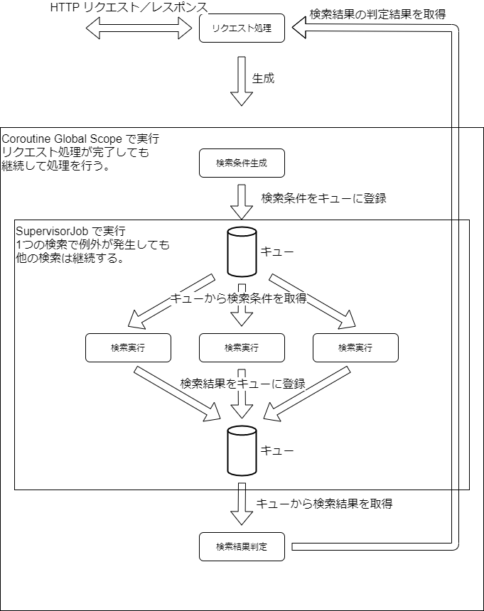

# micronaut-kotlin-blanco-sample
このプロジェクトは、Kotlin 、Micronaut および、blancoDB を組み合わせて利用する場合のサンプルとなる。

## 前提
サンプルコードを動作させるには、MySQL がローカル環境で起動している必要がある。
MySQL 設定ファイルのサンプルとして SQL/my.ini を利用できる。
データディレクトリは、任意のディレクトリに変更する。

```
# データベースの初期化（初回のみ実行）
mysqld --initialize-insecure
# MySQL をコンソールモード（フォアグラウンド実行）で起動
mysqld --console
```

接続ユーザは、root でパスワード無し。
DB 初期化には、SQL/DB_Initial.sql を利用する。

作成する Database は、sample00 となり、
テーブルは、users となる。

## ディレクトリ構成
blancoDB で参照する、SQL 定義書は、meta/db ディレクトリに格納する。
自動生成ソースコードは、blanco/main/ ディレクトリ以下に生成される。

- blanco-libs/  
  blancoDB のソース自動生成時に利用するライブラリを格納
- blanco-meta/db/  
  blancoDB の SQL 定義書を格納
- blanco-src/  
  blancoDB で自動生成したソースを格納
- SQL/  
  MySQL のテーブル定義 SQL を格納

SQL/personal_infomation.txt は、
[疑似個人情報データ生成サービス](https://hogehoge.tk/personal/)
で生成したものを変換したファイルであり、個人情報は含まない。

## blancoDB でのソースコード自動生成方法
blancoDB でのソースコード自動生成方法は、以下のようにする。

- MySQL を起動
- mysql -uroot < SQL/DB_Initial.sql
- gradlew blancoDb

## サンプルコード
サンプルコードは、MySQL を起動した上、gradlew run で起動する。

- [DB 検索・登録・更新](src/main/kotlin/micronaut/kotlin/blanco/sample/UsersController.kt)
- [エラーハンドリング](src/main/kotlin/micronaut/kotlin/blanco/sample/GlobalHandlerController.kt)
- [日時変換処理](src/main/kotlin/micronaut/kotlin/blanco/sample/DateController.kt)
- [データベース並行アクセス](src/main/kotlin/micronaut/kotlin/blanco/sample/DBWithCoroutineController.kt)
- [キュー（Channel）による処理の連携](src/main/kotlin/micronaut/kotlin/blanco/sample/)

### データベース並行アクセス
データベース並行アクセスサンプルコードには、
users テーブルにダミーデータを登録するための処理が含まれている。
以下のコマンドを実行すると、100 万件のダミーユーザデータ 10 並列で生成する。
プライマリキーが既に存在する場合は、更新となるため、上書きで実行できる。
curl -i "http://localhost:8080/db-coroutine/generate?total=1000000&parallel=10"

### キュー（Channel）による処理の連携
キュー（Channel）による処理の連携は、キューとして、Channel を利用して、
処理間の連携を行うサンプルとなる。
連携に関連する処理は、HTTP リクエスト、検索条件生成、
検索実行および、検索結果判定となる。


